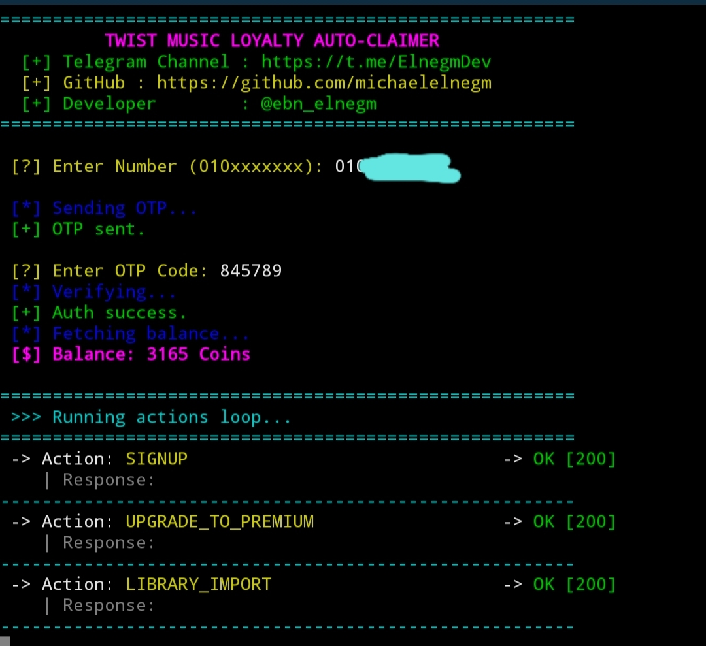

<div align="center">

# 🌌 Hi, I'm Michael Elnegm (النجم) 🌌


---

### 🥷 "If it has an API, I will automate it. If it has a vulnerability, I will find it."

---
</div>

## 🛠️ Tech Stack & Skills

### 💻 Languages & Frameworks
*   **Backend & Scripting:** Python (Requests, Asyncio, BeautifulSoup), Go (Golang), PHP, Bash Scripting.
*   **Web & APIs:** JavaScript (Node.js), HTML5, CSS3, JSON, REST APIs.
*   **Mobile Development:** Dart & Flutter Framework (For building cross-platform utility tools).

### 🛡️ Cyber Security & Web Pen-Testing
*   **Web App Security:** Testing vulnerabilities (OWASP Top 10), authentication bypass, and logic flaws in PHP/JS apps.
*   **API Pentesting:** Exploring endpoints, token manipulation, and request forgery.
*   **OSINT & Recon:** Advanced intelligence gathering and mapping attack surfaces.

### ⚙️ Automation & Tooling
*   **Automation:** Building automated reward claimers, custom scrapers, and interactive CLI tools.
*   **Data Parsing:** Advanced data manipulation and regex extraction from complex JSON/HTML responses.

---

## 📸 Script Interface Preview

<div align="center">
  
</div>

---

## 🚀 Features
*   **Complete Auth Flow:** Automated OTP transmission and token verification (`accessToken`, `tgToken`, `tgRefreshToken`).
*   **Balance Checker:** Automatically fetches and displays your current coin balance before executing tasks.
*   **Loop Automation:** Iterates through 22 pre-configured reward points endpoints (`SIGNUP`, `DAILY_CHECKIN`, `STREAM_SONG`, etc.).
*   **Interactive UI:** Fully stylized and color-coded CLI outputs using `colorama`.
*   **Delay Guard:** Built-in sleep interval between requests to remain stable and avoid sudden rate limits.

---

## 🛠️ Requirements & Installation

1. Clone the repository to your environment:
   ```bash
   git clone [https://github.com/michaelelnegm/Twist-Music-Auto-Claimer.git](https://github.com/michaelelnegm/Twist-Music-Auto-Claimer.git)
   cd Twist-Music-Auto-Claimer
